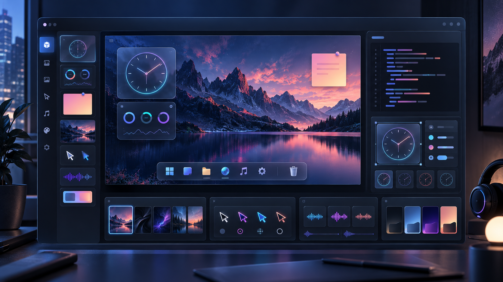
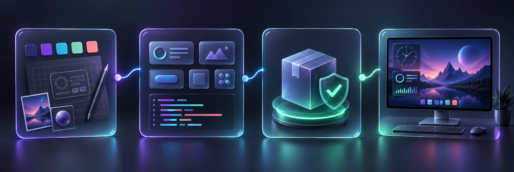

<div align="center">

# Desktop Studio Creator Kit

### Make the desktop feel alive — one widget, theme, sound, cursor, and idea at a time.

An open toolkit for building portable customizations for **Desktop Studio**.
Create with familiar web technologies, expose clean editing controls, validate locally,
and keep ownership of what you make.

[](LICENSE)


[Start creating](#your-first-package) · [ZIP package guide](docs/ZIP-PACKAGES.md) · [Widget format](docs/WIDGET-FORMAT.md) · [Examples](examples) · [Contribute](CONTRIBUTING.md)

</div>



> [!IMPORTANT]
> **The ecosystem is open; the host application is paid.** This repository contains the
> public creator contract, schemas, examples, and tools. It does not license or distribute
> the proprietary Desktop Studio application.

## A canvas for desktop creators

Desktop Studio is designed so a customization is not a flattened preset that nobody can
edit. A package can describe its own content, sensible defaults, user-facing controls,
permissions, provenance, and version — while the host keeps installation and runtime safe.

| Create | What it can become | Creator Kit status |
| --- | --- | --- |
| **DOM Widgets** | Local HTML, CSS, and JavaScript with editable properties | Creator ZIP v1 |
| **Stickers** | Portable images, SVG art, and GIFs | Creator ZIP v1 |
| **Wallpapers** | Local images, GIFs, and video | Creator ZIP v1 |
| **Effects** | Bounded rain, snow, and fog definitions | Creator ZIP v1 |
| **Companions** | Images, GIFs, and sprite sheets with animation clips | Creator ZIP v1 |
| **3D** | Local GLB, GLTF, and VRM models with bounded defaults | Creator ZIP v1 |
| **Complete themes** | A desktop project and its packaged assets | Desktop Studio Export ZIP |
| **Cursor packs** | Complete Windows cursor roles with animation and hotspots | Contract in development |
| **Sound packs** | Individually configurable Windows event sounds | Contract in development |

The public format only promises features that the shipping host implements and tests.
Reserved capabilities remain clearly marked instead of silently becoming unstable APIs.

## Your work stays yours

- You retain ownership of your original art, code, audio, and package design.
- You choose whether your package is private, shared for free, or distributed commercially.
- Creator Kit code and examples use the permissive [MIT License](LICENSE).
- Package provenance can record the author, license, source, and dependencies.
- The Desktop Studio name, application code, and official commercial assets are separate
  from this license.

The long-term goal is a healthy creator ecosystem: open formats and tools, a paid polished
host, free community creations, and room for creators to publish premium work later.

## From idea to desktop



The workflow stays intentionally simple: design the experience, build it from portable
parts, validate the package, then preview it inside Desktop Studio. The validator and public
contract catch unsafe or incompatible content before it reaches a user's desktop.

## Your first package

You only need **Node.js 22+** for the included validator and ZIP packager. They have no
third-party runtime dependencies. A widget is ordinary local HTML, CSS, and JavaScript
with no build framework required.

```bash
git clone https://github.com/AnTheez/desktop-studio-creators.git
cd desktop-studio-creators
npm test
```

Copy [`examples/hello-widget`](examples/hello-widget), give it a stable namespaced ID, and
start editing:

```text
my-widget/
├── manifest.json       identity, size, permissions, editable properties
├── index.html          local entry point
├── styles.css          visual design
├── widget.js           bounded lifecycle behavior
├── settings.json       default values
└── assets/             local images, fonts, and media
```

A minimal manifest stays readable:

```json
{
  "formatVersion": 1,
  "id": "your-name.hello-widget",
  "type": "widget",
  "name": "Hello Widget",
  "version": 1,
  "entryPoint": "index.html",
  "defaultSize": { "width": 360, "height": 180 },
  "runtime": "dom",
  "permissions": []
}
```

Validate a package folder, then create its ZIP outside that folder:

```bash
npm run validate -- examples/hello-widget
npm run package -- examples/hello-widget hello-widget.zip
```

For an image-only starting point, use [`examples/hello-sticker`](examples/hello-sticker):

```bash
npm run validate -- examples/hello-sticker
npm run package -- examples/hello-sticker hello-sticker.zip
```

The packager validates first and never overwrites an existing ZIP. Read the
[ZIP package guide](docs/ZIP-PACKAGES.md) for manifest fields, supported content, safety
rules, and import behavior. The [DOM Widget format v1](docs/WIDGET-FORMAT.md) explains
widget properties and lifecycle messages.

## Import into Desktop Studio

Use the app's ZIP import flow to open the guide and review the package preview before
installation. Creator components appear in **Library → Imported** and can be added to a
desktop project. They do not create a project by themselves.

A complete theme ZIP comes from **Export** inside Desktop Studio. It imports as a project
in **Projects** (shown as **Desktops** in the app), rather than as a single Library component.
The Creator Kit packager creates component ZIPs; use app Export for complete themes.

If a package ID already exists, the app offers **UseExisting** or **Copy**. UseExisting
reuses the installed package; Copy keeps a separate copy. Neither choice replaces the
existing package or its saved user data. Keep a stable namespaced `id` and increase the
integer manifest `version` when releasing updates; a higher version does not authorize
replacement during import.

## Settings without building a settings screen

Declare properties in `manifest.json`, and Desktop Studio can generate understandable
Inspector controls for the user:

```json
{
  "properties": {
    "title": {
      "type": "text",
      "default": "Hello desktop",
      "label": "Title"
    },
    "accent": {
      "type": "color",
      "default": "#9d8cff",
      "label": "Accent"
    },
    "cornerRadius": {
      "type": "slider",
      "default": 24,
      "label": "Corner radius",
      "min": 0,
      "max": 60,
      "step": 1
    }
  }
}
```

This keeps packages easy to customize and makes the same controls work consistently in the
editor, preview, and desktop runtime.

## Open does not mean unsafe

Community packages are treated as untrusted input. Desktop Studio validates before install,
runs DOM Widgets in a sandbox, blocks remote resources by default, and grants only bounded
capabilities declared by the package and allowed by host policy.

Packages cannot use:

- native `.exe` or `.dll` payloads;
- absolute paths, path traversal, or reparse points;
- arbitrary filesystem, registry, process, or Windows API access;
- hidden downloads or undeclared permissions.

Known permission names are `audio`, `systemMetrics`, `input`, `network`, and `storage`.
Declaring one is a request, not an automatic grant. Most widgets should request none.

## Why a separate Creator Kit?

Keeping the creator contract separate gives both sides a clean boundary:

- creators can inspect, discuss, test, and improve formats without receiving proprietary
  application code;
- Desktop Studio can remain a supported commercial product with Steam delivery, safe
  system integration, updates, and ownership verification;
- package formats can evolve through versioned public proposals instead of undocumented
  implementation details;
- community content stays portable and does not depend on secret APIs.

## Project stage

Desktop Studio and its Creator Kit are under active pre-1.0 development for Windows.
Creator ZIP v1 covers widgets, stickers, wallpapers, effects, companions, and 3D components.
Complete theme ZIPs use the app's Export format. Cursor packs, sound packs, and Workshop
publication remain outside this toolkit's current package contract.

Ideas and improvements are welcome through issues and pull requests. Please read
[`CONTRIBUTING.md`](CONTRIBUTING.md) before proposing a new permission, runtime, or package
capability.

<div align="center">

**Build something useful. Make it unmistakably yours. Share it safely.**

</div>
